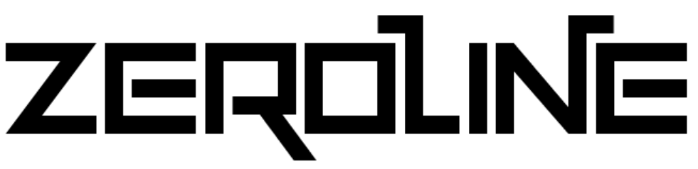
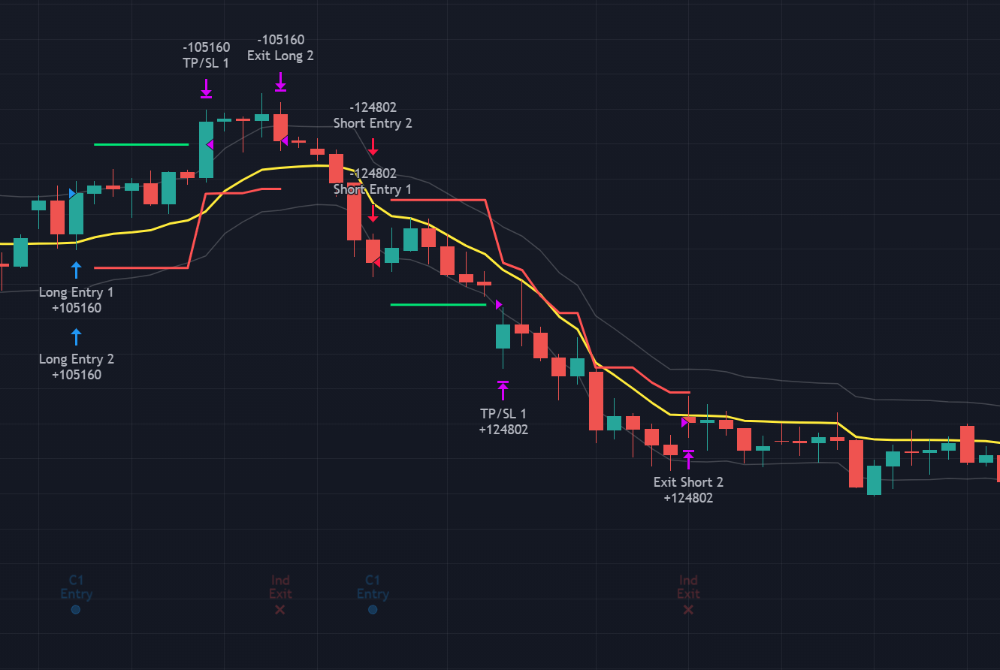
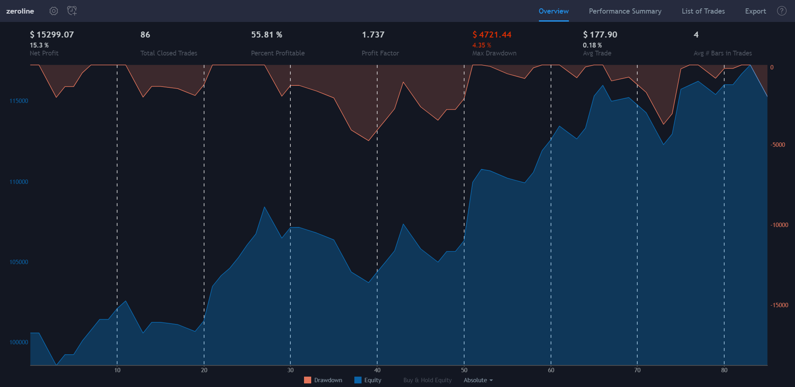

    

## Disclaimer
Trading Forex involves a risk of loss. Please consider carefully if such trading is appropriate for you. Past performance is not indicative of future results. The content on this site is for research and informational purposes only and does not constitute investment recommendations or advice.

## Description
This algorithm is designed to identify and trade trends in the foreign exchange (forex) and commodities market. It is constructed using a set of technical indicators that trigger trade entry and exit and uses money management to limit risk and maximise upside potential.

It has been developed and tested in Metatrader 4 and Trading View, this algorithm is written in pine script can be deployed as a strategy on Trading View and used for back testing on any instrument that is available on the platform. 

Testing across the major pairs (USD, EUD, JPY, CHF, GBP, AUD, NZD) yields a *theoretical* annualized ROI of ~20% per annum with less than 8% drawdown however it is critical to note that the performance will vary in practical application once rules are added to avoid the volatility associated with news events and limit exposure.

This algorithm and script utilise the No Nonsense Forex (NNFX) trading methodology and has been developed using the TradingView Strategy Coding Series on YouTube, so a huge thank-you and full credit to the creators that content VP and Dillon Grech. For those new to this arena please ensure you consume all of the content at the links provided in the acknowledgements before attempting to use this tool.

My intent in releasing this work is three-fold, firstly to share with the community that supported the build, and secondly for people new to this field can access this resource to leverage as a reference point. Finally, there is still signficant potential for improvement of the algorithm and the associated strategy so I welcome anyone from the community who wishes to contribute to the codebase.

## Installation

1) Sign-up and create a free Trading View account
2) Click on Pine Editor and Open > New Blank Strategy
3) Paste the contents of zeroline.pine and click save

## Usage

1) Example Chart View:

2) Example Strategy Tester Output:

## Roadmap
* Add option for multiple exit indicators
* Incorporate risk management using $EVZ level
* Combine Indicators to single on chart indicator
* Simplify/Improve on chart plotting
* Optimise indicator combinations to improve ROI!

## Known Issues
* Indicator/Strategy performance on Trading View  differs to performance on MT4 
* Trailing Stop Loss on scaled out order does not specifically follow the NNFX method (1.5x ATR > Break Even > Trail at 1.5x ATR after 2x ATR) rather it trails at 1.5x ATR from point of order entry due to Trading View platform limitations.
* Historical volume data for the 28 currency pairs on Trading View can occasionally change depending on the time the strategy is loaded (data quality issue).
* Results will vary based on broker used, all testing on both MT4 and TradingView has used historical data from FXCM.

## Acknowledgements
I'd like to thank the online community for the support, guidance and education in creating this and specifically call out the following people whose stategy, research and source code has been used to develop this project. 

* VP - No Nonsense Forex - [YouTube](https://www.youtube.com/channel/UCc8IRYpgBr4NGbaQFnd2b-A)
* Dillon Gresch - The Trading Journal - [YouTube](https://www.youtube.com/channel/UCl1a4qyx_HaodV0AN9ve46A)
* Odir Aguiar - DIDI Index
* John Ehlers - Ehlers Fisher Transform
* Mladen - Trend Direction and Force Index
* Perry Kaufman - Kaufman's Adaptive Moving Average
* ? - Oscar
